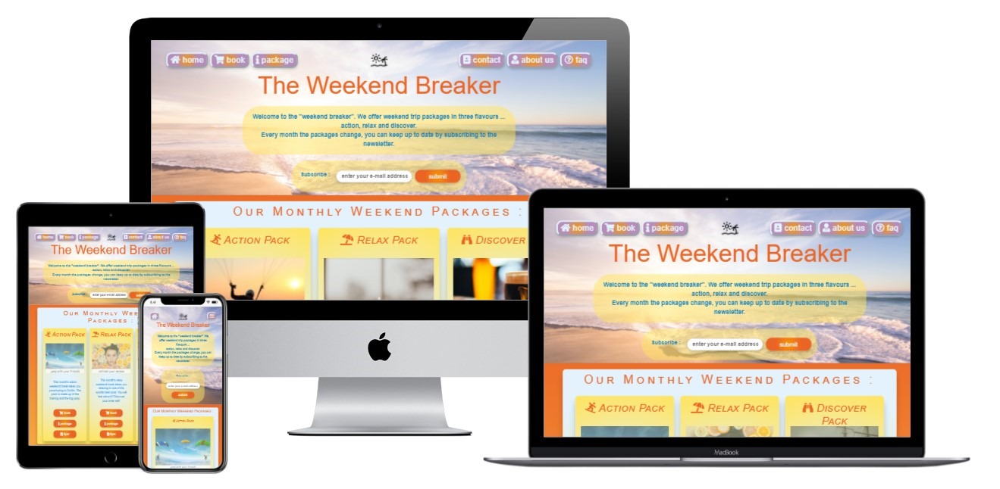
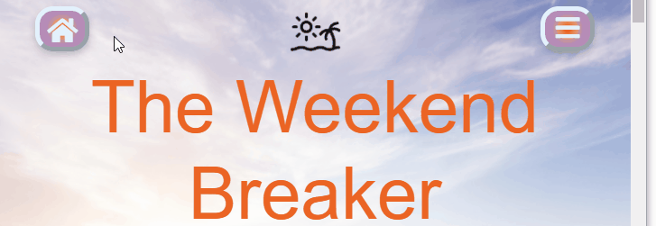
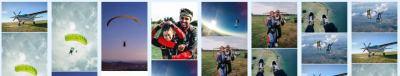
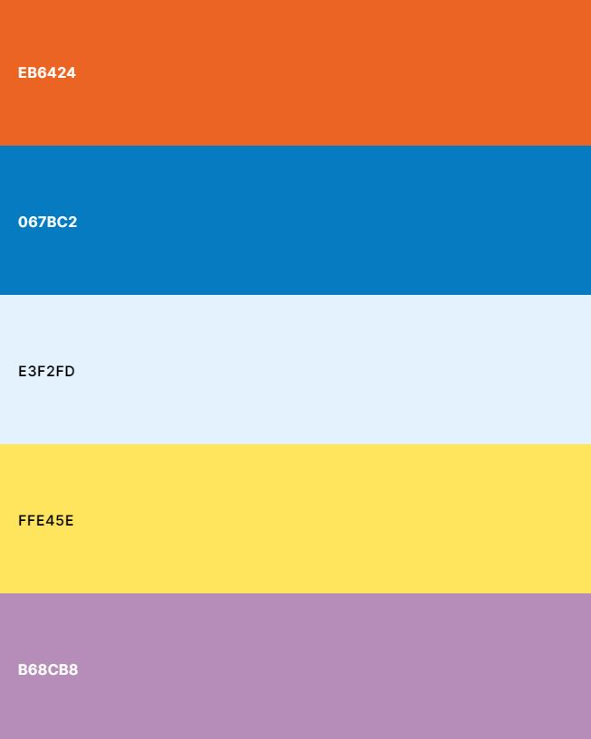

# The Weekend breaker
## An Overview

The website offers 3 different weekend break packages for the user to choose from. The packages change every month.

The site targets users who need a break from work and want to get away for a weekend to recharge.

*the mockup shows the side in different sizes ( [techsini.com](http://techsini.com/multi-mockup/index.php "opens a new page (in a new tab) to techsini") )*

## Main Features
- **navigation bar**
    
    - intuitive icons
    - hover effect changes font color and shows hint
    - "hamburger" menu expanse when there is enough width
    - nav bar moves with the page down
    - unique design *(buttons float over the page)*
- **mobile first** design
    
    - images are loaded by the browser according to the screen width  
    *(saves download time for mobile phones)*
    - responsive layout  
    *("product card" column changes from 1 to 3)*
    - changing the browser font-size dose not break the design  *(media queries are in **em** and length units are in **rem** or **%**)*
- **animations**
    - the images in the "product card" change every 10 seconds  *(to keep the user engaged)*
    - user reviews change in intervals through slides  
    *(with the help of Bootstrap)* 
    - the price on the "booking" page uses CSS animation to create an flash effect
- image **sprite**
    
    - three image sprites have been used to display together 24 images  
    *(increase performance by reducing the requests the browser needs to make to the server)*
- **form validation**
    - has been used on all input elements  
    *(avoids bad data and hacker attacks to the server)*

***
# 1. User Experience (UX)
## The User Stories  
Are the stories about the **values** the user and the owner are looking for.  

- **the visitor stories :** As a visitor to the site ...  
    1. ... I want to know what the site is about.  
    *(the first text the user reads is an overview of the side)*
    2. ... I want to know if I can trust the site.  
    *(user feedback, the "about us" and "contact" section should build up user trust)*
    2. ... get inspired.  
    *(images and slogans should inspire the user)*
    3. ... find an easy way to navigate the side.  
    *(the navigation bar is fixed to the viewport and uses intuitive icons)*
    4. ... keep up to date with changes.  
    *(the user can subscribe)*
    5. ... get help if I need it.  
    *("contact us" and "faq" section)*
    6. ... I want to enjoy a fast and responsive site.  
    *(site is build mobile first and has a very good performance)*  
     

- **the business stories :** As a business owner of the site ...  
    1. ... I want to offer my clients the possibility to stay up to date  
    *(user can subscribe)*
    2. ... keep my clients engaged with animations and images  
    *(the site has moving elements which should help to draw attention, a wide selection of pictures)*
    3. ... present my product in an easy to understand form  
*(the user gets the landing page an overview of the package and can get more detailed information on an separate page)*
    4. ... make sure that my data base gets not hacked or filled with invalid information  
    *(form validation is used on the booking page and on the subscribe input element)*  
***
# 2. The Scoop
## Future release :
- user login account
- current weather at holiday location widget
- shopping cart
- chatbot
***
# 3. The Structure
How the user is navigating the side.
## Information Architecture (IA)
#### **Navigation menu on mobile :**
- two main navigation buttons which are consistent on every page  
    1. home button, which takes the user always back to the landing page
    2. "hamburger menu" which contains the remaining navigation buttons  
- buttons are lager so they can be accessed 
- buttons contain easy to understand icons
- the "faq", "about us", "contact us" leading to section on the landing page but can be accessed from any of the other sites
- the navigation bar is also working as locator for sections on the landing page
- "book" and "package" have there own individual sites  
- navigation bar is fixed to the top section of the viewport (any time accessible)
#### **Navigation menu on tablet, desktop :**
- works the same way to make it easier for the user
- only differences are :
    - when there is enough space, the navigation bar unfolds from the "hamburger menu"
    - the following features are also working for mobile but require a mouse :
        - on hover the text color changes to indicate, that it is a clickable button
        - on hover a text appears to give more explanation

***
# 4. The Skeleton
The wireframes have been created with "Balsamiq".
- The original wireframes can be found here [mobile](assets/docs/wireframe_mobile_weekend-break.pdf) and here [desktop](assets/docs/wireframe_desktop_weekend-break.pdf) .

***
# 5. The Surface (the design)
## Color Scheme

The site uses colors which remained the user on summer.
- orange, like the sun when she rises or sets
- blue, like the see or sky
- yellow like the beach or sun  

*(the palette has been created with [coolors](https://coolors.co/))*  

The colers are not too intense, to get the user in a more relaxed mood.

The site also uses gradients, to mix the main colors together.

*(the gradient was created with [cssgradient](https://cssgradient.io/))*

This style creates a easy summery look.

## Font Style
Uses with the standard font 

---
## Testing

### Validator Testing

### Unfixed Bugs

---

## Deployment

---

## Credits

### Content

### Media

