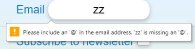

# The Weekend breaker

The website offers 3 different weekend break packages for the user to choose from. The packages change every month.

The site targets users who need a break from work and want to get away for a weekend to recharge.

*the mockup shows the side in different sizes ( [techsini.com](http://techsini.com/multi-mockup/index.php "opens a new page (in a new tab) to techsini") )*

## Features
- **navigation bar**
    
    - intuitive icons
    - hover effect changes font color and shows hint
    - "hamburger" menu expanse when there is enough width
    - nav bar moves with the page down
    - unique design *(buttons float over the page)*
- **mobile first** design
    
    - images are loaded according to screen width  
    *(saves download time for mobile phones)*
    - responsive layout  
    *("product card" column changes from 1 to 3)*
    - changing the browser font-size dose not break the design  *(media queries are in **em** and length units are in **rem** or **%**)*
- **animations**
    - the images in the "product card" change every 10 seconds  *(to keep the user engaged)*
    - user reviews change in intervals through slides  
    *(with the help of Bootstrap)* 
    - the price on the "booking" page uses CSS animation to create an flash effect
        
- image **sprite**
    
    - three image sprites have been used to display together 24 images  
    *(increase performance by reducing the requests the browser needs to make to the server)*
- **form validation**
        
    - has been used on all input elements  
    *(avoids bad data and hacker attacks to the server)*

---
## Testing

### Validator Testing

### Unfixed Bugs

---

## Deployment

---

## Credits

### Content

### Media

