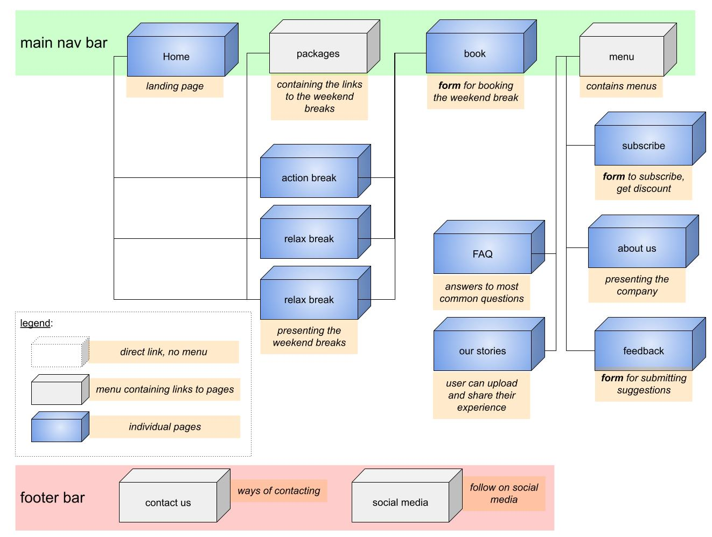

# UCD development for the website "The Weekend Break"

## 1. The Strategy, Product Objectives

### Business Needs:
#### What do we want to get out of this product?
- sell weekend breaks
- keep and extend  a loyal  consumer base
- gather information about user needs

### User Needs:
#### What do our users want to get out of it?
- find easily a weekend break
- get inspired
- share there experience

---
## 2. The Scope
### **Features :**
- pages :
    - **"home"** :
        - *(help the user to understand what the side is about and keep him interested)*
        - overview of ...
            - who we are
            - what we offer
            - the 3 weekend breaks with links to ...
                - more info
                - booking
                - download flyer
    - **"about us"** :
        - who we are *(to increases sites credibility)*
            - the owner
            - the company
            - the history
    - **"subscribe"** :
        - contains form for user to subscribe
        - to gather information about user
        *(create user database)*
        - to keep user interested with:
            - new locations
            - offer discount *(price draw?)*
    - **"trip of the month"** :
        - showcase 3 types of holiday breaks *(action, relax, discover)*
        - each of the holiday break packages has its own site which should contain :
            - images, video, sound
            - the program
            - a interactive map which highlights key locations when hovered
            - testimonials from previous users
            - download brochure with key-info
            - link to the booking page
        - location changes every month
        *(to keep user interested)*
    - **"booking"** :
        - contains form to place the order for the weekend package
    - **"our stories"** :
        - user can upload and share there stories
        - offer discount for users who share their experience
        - motivate and inspirer other users
    - **"feedback"** :
        - contains a form to submit feedback *(improve site and service)*
    - **"FAQ"** :
        - list of frequent asked questions and there answers

- create brand logo as a gif *(to have a animation == more memorable)*
- text transition from one side of the page to the other to promote "subscribing"
- use css animation to simulate interactively and draw attention

### **Future release :**
- user login account
- current weather at holiday location widget
- shopping cart
- chatbot

---
## 3. The Structure
### Information Architecture (IA)
#### **Navigation menu on desktop and laptops :**

#### Type: (Flat) Hierarchical Tree Structure
- reduces complexity
- quick access
- main nav bar sticky *(enough space, easy navigation)*

#### **Navigation menu on mobile :**

#### Type: Nested List :
- linear path to detail
- reduces complexity
- "burger menu" contains remaining pages to save space
- main navbar **not** sticky *(save space)*

---
## 4. The Skeleton
- visual iconography and these visual conventions *(use of familiar icons & sticking to conventional design)*
    - icons should provide clear meaning, and they should be familiar objects
- The main content areas for each page have the same shape.
- provide consistency, we ensure the same interactions and behaviors appear across our content
- Don't rearrange the order progressive disclosure
- Reveal information over time and across space.
- **"Hick-Hyman"** law
    - the more choices the users has, the longer it will take him to make a decision *(may be he will not decide and leave)*

### **Desktop & tablet wireframe :**
*wireframe home page*

*wireframe about us page*

*subscribe page*

*wireframe package page*

*wireframe booking page*

*wireframe our stories page*

*wireframe feedback page*

*wireframe FAQ page*

### **Mobile wireframe :**

*mobile wireframe home page*

*mobile wireframe about us page*

*mobile subscribe page*

*mobile wireframe package page*

*mobile wireframe booking page*

*mobile wireframe our stories page*

*mobile wireframe feedback page*

*mobile wireframe FAQ page*

---
## 5. The Surface

### **website / company logo :**

The sun, the palm and the beach are symbolic for holidays. They help to convey the meaning of the website. The slogan "You deserve it!" is helping to justify the purchase to the consumer.

The icon is sourced from: [iconfinder.com](https://www.iconfinder.com/search?q=travel&price=free), Creator: Fajar Sullivan

**Font:** east see dokdo **Color:** hex #e69138

**Font:** Josefin Sans **Color:** hex #000000

"missing color pattern"
"missing font family"
"missing icon style"